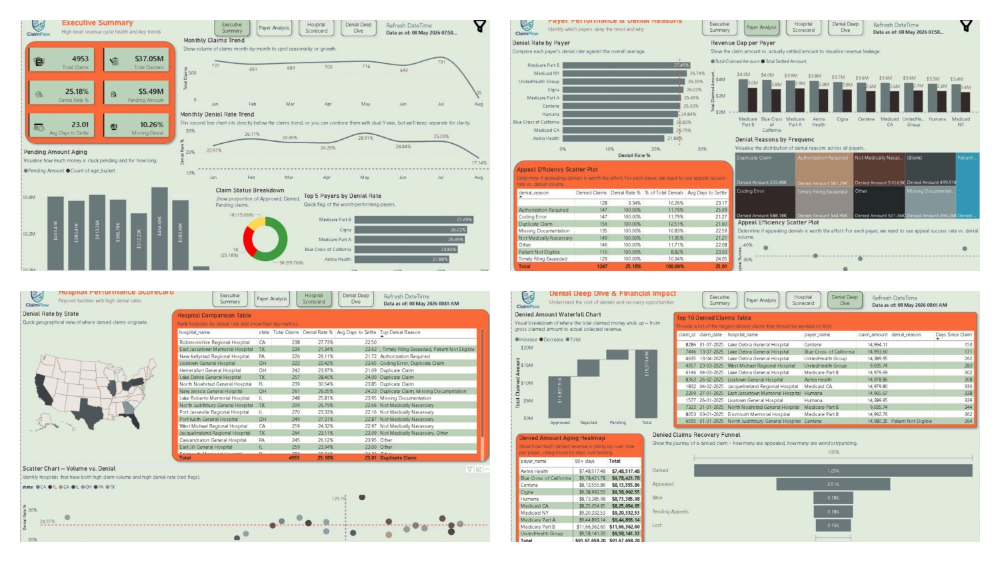
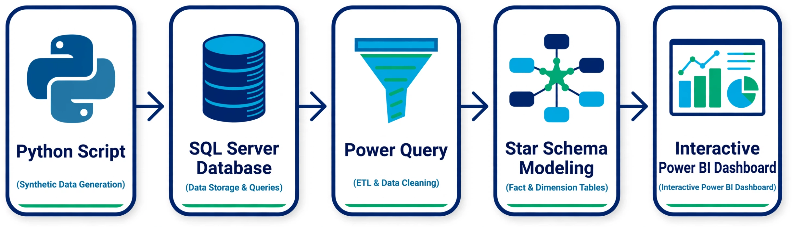

# ClaimFlow — Revenue Cycle & Claims Recovery Analytics

  

## Overview
Healthcare providers face significant revenue leakage every year due to denied claims, delayed insurance payouts, and billing inaccuracies. 

**ClaimFlow** is an end-to-end data analytics project designed to track claims through their entire lifecycle. Built primarily around Power BI, SQL Server, and Python, this solution translates complex billing and payer data into clear operational metrics—helping revenue cycle teams identify high-risk payers, speed up settlements, and prioritize claim appeals.

---

## Executive Case Study
A detailed breakdown of the business scenario, data architecture, and analytical methodology is available in the documentation folder:

📁 **[View Case Study Presentation (PDF)](./Docs/ClaimFlow_Revenue_Cycle_Analytics_Case_Study.pdf)**

---

## Technical Architecture
The data pipeline flows from raw data generation through staging, ETL, dynamic modeling, and interactive reporting.

  

* **Data Engineering (Python & Excel):** Scripted realistic billing and settlement data, performing initial structural checks.
* **Database Management (SQL Server):** Built relational schemas, stored procedures, and analytical SQL queries to aggregate claim metrics.
* **ETL & Data Cleaning (Power Query):** Cleaned raw tables, transformed dates, and handled missing values.
* **Data Modeling (Power BI):** Modeled an optimized Star Schema linking `fact_claims` to dimension tables (`dim_hospitals`, `dim_payers`, `dim_date`).
* **BI & Data Visualization (Power BI):** Developed interactive multi-page dashboards utilizing DAX measures, parameters, custom tooltips, and dynamic filtering.

---

## Business Impact & Findings
1. **High Commercial Denial Rates:** Commercial payers average a 15–18% denial rate, with missing documentation being the single largest contributor.
2. **Aging Revenue Bottlenecks:** Over $450K in revenue remains stuck in pending status, with ~20% of these claims delayed for more than 90 days.
3. **Appeals Opportunity:** Systematic tracking and filing of high-value claim appeals successfully recovers up to 50% of lost revenue.

---

## Author
**Pushpal Kawara**  
*Data Analyst & Power BI Specialist*

* Email: pushpalanalytics@gmail.com
* Phone: +91 7796004314
* LinkedIn: https://www.linkedin.com/in/pushpalanalytics/
